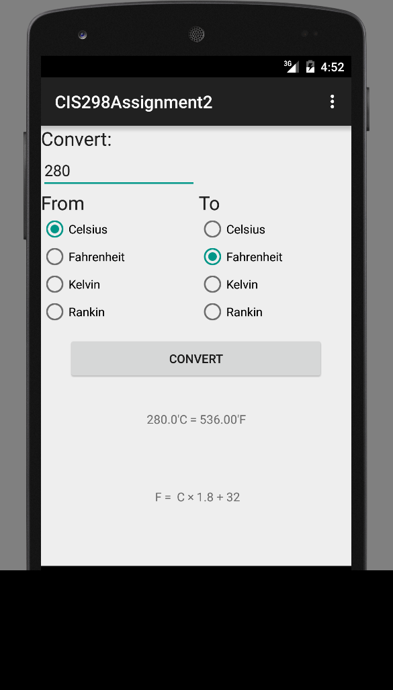
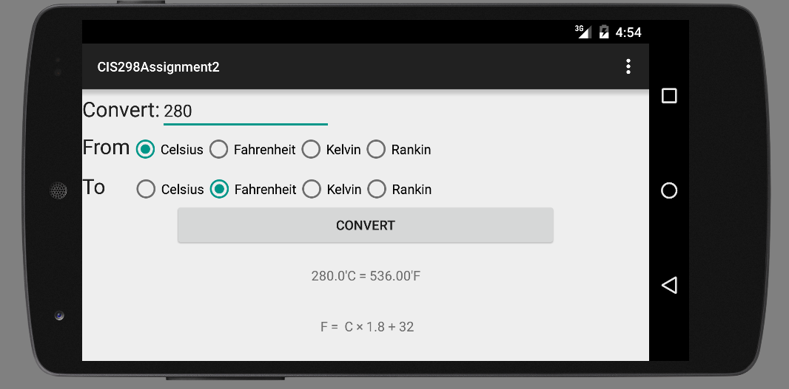

# Assignment 2 - Temperature Converter

## Author

Yihan Wang

## Description

Create a temperature converter application.
The application should look like the screen shots I have provided.
The application should do the calculation and display the formula that was used to do the calculation.
The calculation of the conversion should take place in a seperate class
The application should handle errors gracefully.
The application should have a different layout for landscape form that looks like the one pictured here.
The application must retain it's information on the screen when rotated to lanscape.

The temperature converter application allows users to freely convert from one temperature type to another by inputting a original decimal number and selecting one temperature type from the "From" radio group and selecting another temperature type from the "To" radio group. At last, by clicking the "CONVERT" button, users can get their result along with the used formula in the textView area.

Solution Requirements:

* Seperate class for calculation 
	Septerate class:TemperatureType.java

* Handle errors gracefully
	Toasts are used for handling input errors from user.

* Seperate Layout for landscape
	Seperate layout for landscape: res->layout->activity_temperature_converter.xml(land)

* Retain information across rotation
	Retain information across rotation by using onSaveInstanceState and onRestoreInstanceState

### Notes

 
 

## Outside Resources Used

	Formula from http://www.csgnetwork.com/temp2conv.html

## Known Problems, Issues, And/Or Errors in the Program

	Typing numbers in the number pad doesn't work when testing the app while the numbers on the main keyboard work just fine.

